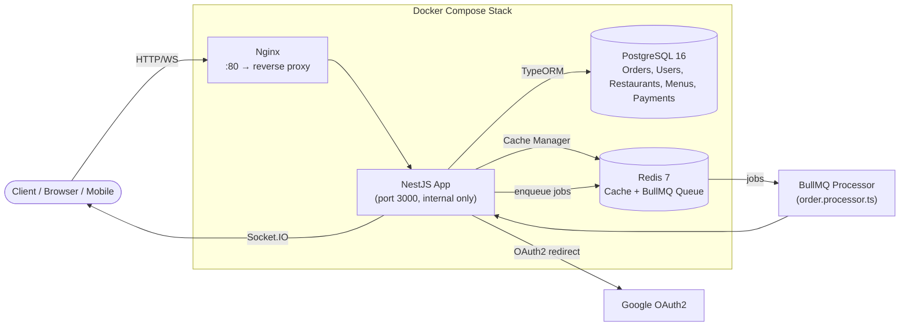
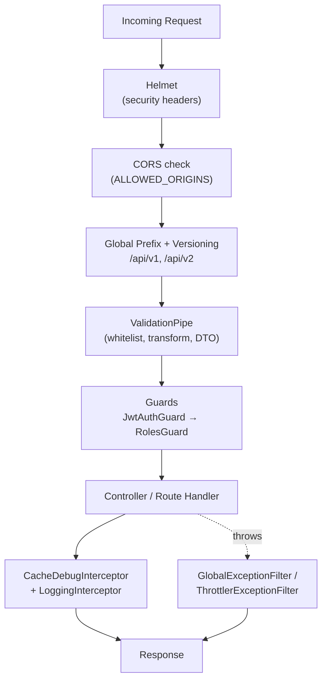
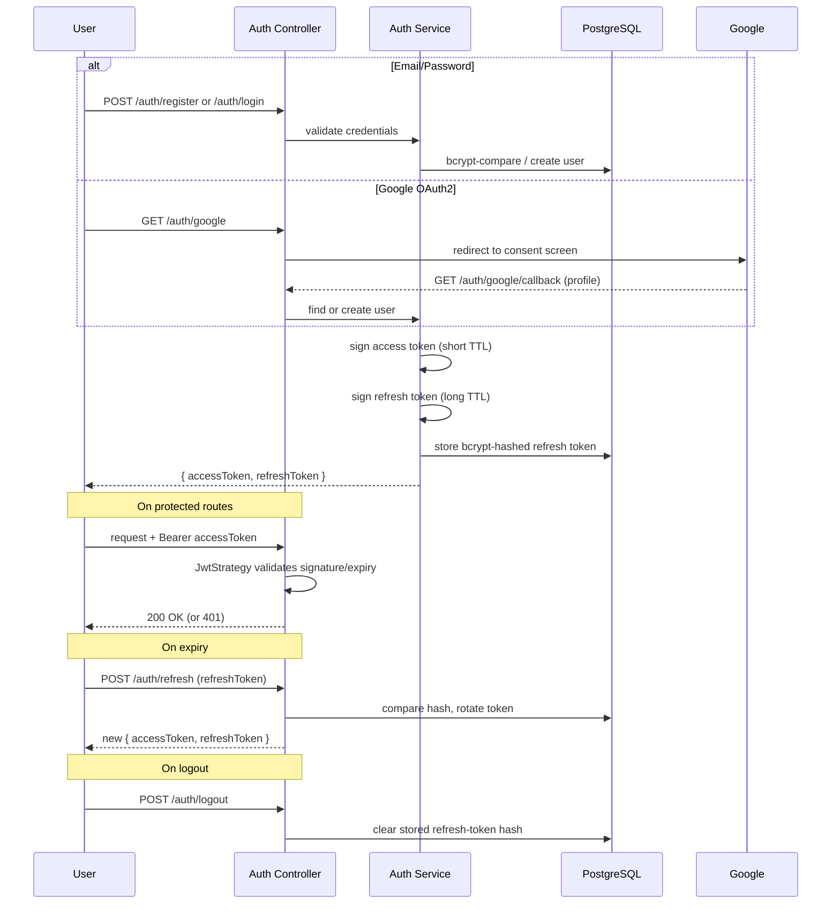
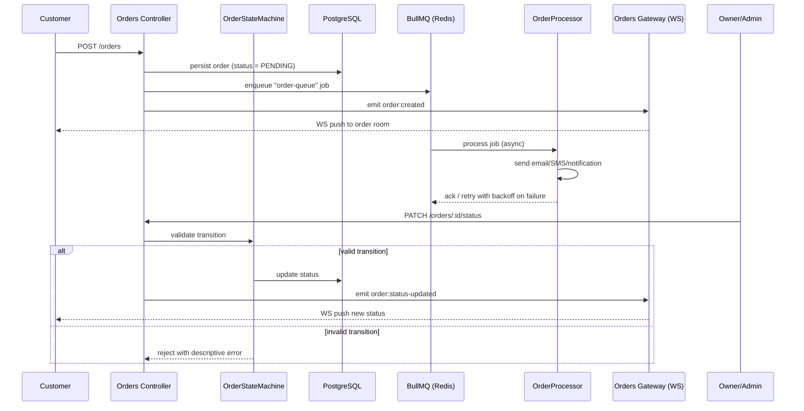
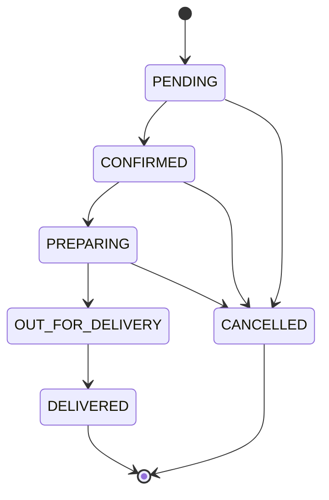
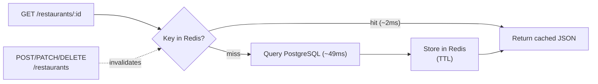
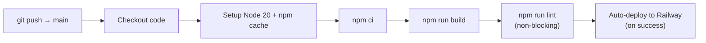

# 🍔 Foodeli — Food Ordering Backend API

A production-ready **NestJS** backend for a food ordering platform, featuring real-time order tracking, background job processing, Redis caching, and comprehensive security.

> ⚠️ **live demo**:https://foodeli-backend-l4i5.onrender.com/api/docs 

💻 **GitHub**: https://github.com/tahmid-100/foodlei

---

## Table of Contents

- [Tech Stack](#tech-stack)
- [System Architecture](#system-architecture)
- [Request Lifecycle](#request-lifecycle)
- [Auth Flow (JWT + Refresh + OAuth2)](#auth-flow-jwt--refresh--oauth2)
- [Order Flow (State Machine + Queue + WebSocket)](#order-flow-state-machine--queue--websocket)
- [Caching Strategy](#caching-strategy)
- [Key Features](#key-features)
- [Project Structure](#project-structure)
- [API Endpoints](#api-endpoints)
- [Getting Started](#getting-started)
- [Deployment](#deployment)
- [CI/CD](#cicd)
- [Security Highlights](#security-highlights)
- [Author](#author)

---

## Tech Stack

| Layer | Technology |
|-------|-----------|
| Framework | NestJS + TypeScript |
| Database | PostgreSQL + TypeORM |
| Cache | Redis (24× faster response) |
| Queue | BullMQ + Bull Board (dashboard at `/queues`) |
| Real-time | WebSockets (Socket.IO) |
| Auth | JWT + Refresh Token + OAuth2 (Google) |
| Docs | Swagger / OpenAPI (`/api/docs`) |
| Reverse Proxy | Nginx (Docker Compose stack) |
| Deploy | Railway + Docker + GitHub Actions |

---

## System Architecture

The app runs behind Nginx, which is the single public entry point. Nginx forwards traffic to the NestJS app container, which talks to Postgres (persistent data), Redis (cache + BullMQ job queue), and Google's OAuth service.



**Why this shape:**
- The app container never exposes port 3000 directly — only Nginx is published (`80:80`), matching `docker-compose.yml`.
- Redis is dual-purpose: it backs `cache-manager-redis-yet` for response caching **and** BullMQ for the job queue — same container, two responsibilities.
- Bull Board is mounted directly on the underlying Express instance (not through Nest's router) at `/queues`, bypassing the global `api` prefix — see `src/main.ts`.

---

## Request Lifecycle

Every incoming request passes through a consistent pipeline before it reaches a controller:



This mirrors the bootstrap order in `src/main.ts`: Helmet → CORS → prefix/versioning → `ValidationPipe` → exception filters → interceptors → Bull Board → Swagger.

---

## Auth Flow (JWT + Refresh + OAuth2)

Two ways in: password login or Google OAuth2. Both end with an access/refresh token pair; refresh tokens are hashed before being stored so a leaked DB dump alone can't be replayed.



- Strategies live in `src/modules/auth/strategies/`: `jwt.strategy.ts`, `jwt-refresh.strategy.ts`, `google.strategy.ts`.
- `RolesGuard` + `@Roles()` decorator enforce **Admin / Restaurant Owner / Customer** access after authentication succeeds.

---

## Order Flow (State Machine + Queue + WebSocket)

Placing an order writes to Postgres, enqueues a background job for side effects (email/SMS/notifications), and pushes a live update over a Socket.IO room — the client never has to poll.



### Order State Machine



Invalid transitions (e.g. `DELIVERED → PENDING`) are rejected by `order-state-machine.service.ts` with a descriptive error instead of a silent write.

Failed BullMQ jobs (`order.processor.ts`) retry with **exponential backoff**; all queue activity — pending, active, completed, failed jobs — is inspectable live at `/queues` via Bull Board.

---

## Caching Strategy

Read-heavy endpoints (restaurant listings/details) are cached in Redis. A cache hit skips the database entirely, cutting response time from ~49ms to ~2ms.



`CacheDebugInterceptor` annotates responses so you can see whether a given request was served from cache during development.

---

## Key Features

- **JWT Auth** — Access + refresh token rotation with revocation on logout
- **OAuth2** — Google login via Passport.js
- **RBAC** — Admin / Restaurant Owner / Customer roles
- **State Machine** — Order lifecycle enforcement (see diagram above)
- **Real-time** — WebSocket order tracking via Socket.IO rooms
- **Job Queue** — BullMQ with exponential backoff retry (email, SMS, notifications) + Bull Board dashboard
- **Redis Caching** — 49ms → 2ms response time on restaurant endpoints
- **Webhook Security** — HMAC-SHA256 signature verification for payment callbacks
- **Security** — Helmet, CORS, rate limiting, input validation, global exception filter
- **API Versioning** — `/api/v1/` and `/api/v2/` side by side

---

## Project Structure

```
src/
├── common/                  # Shared utilities
│   ├── constants/           # Cache & queue keys
│   ├── decorators/          # @CurrentUser, @Roles
│   ├── filters/             # GlobalExceptionFilter
│   ├── guards/               # JwtAuthGuard, RolesGuard
│   └── interceptors/        # CacheDebugInterceptor, LoggingInterceptor
├── config/                  # Database config
├── database/
│   └── migrations/          # TypeORM migrations
└── modules/
    ├── auth/                # JWT, OAuth2, Refresh token
    │   └── strategies/      # jwt, jwt-refresh, google
    ├── health/               # Liveness/readiness endpoints
    ├── users/                # User management
    ├── restaurants/         # CRUD + Redis caching (+ v2 controller)
    ├── menus/                # Menu management
    ├── orders/               # State machine + WebSocket gateway + BullMQ
    │   ├── gateways/         # orders.gateway.ts (Socket.IO)
    │   └── processors/       # order.processor.ts (BullMQ worker)
    └── payments/             # Webhook handler + payment records
```

---

## API Endpoints

### Auth
```
POST   /api/v1/auth/register        Register new user
POST   /api/v1/auth/login           Login
POST   /api/v1/auth/refresh         Refresh access token
POST   /api/v1/auth/logout          Logout + revoke token
GET    /api/v1/auth/me              Current user profile
GET    /api/v1/auth/google          Google OAuth login
```

### Restaurants
```
GET    /api/v1/restaurants          List (paginated, filtered, cached)
POST   /api/v1/restaurants          Create (Admin/Owner only)
GET    /api/v1/restaurants/:id      Details (cached)
PATCH  /api/v1/restaurants/:id      Update (Admin/Owner only)
DELETE /api/v1/restaurants/:id      Soft delete (Admin only)
```

### Orders
```
POST   /api/v1/orders               Place new order
GET    /api/v1/orders/my            My orders
GET    /api/v1/orders/:id           Order details
PATCH  /api/v1/orders/:id/status    Update status (Admin/Owner only)
WS     /orders                      Real-time tracking (Socket.IO)
```

### Payments
```
POST   /api/v1/payments/webhook     Payment gateway webhook (HMAC verified)
GET    /api/v1/payments/order/:id   Order payment history
```

---

## Getting Started

### Prerequisites
- Node.js >= 20
- PostgreSQL
- Redis

### Installation

```bash
git clone https://github.com/tahmid-100/foodlei.git
cd foodlei
npm install
cp .env.example .env   # Fill in your values
npm run start:dev
```

### Docker (recommended)

Spins up the full stack shown in the [architecture diagram](#system-architecture) — Postgres, Redis, the app, and Nginx as the reverse proxy:

```bash
docker compose up --build
```

Access points:
- API: http://localhost/api/v1
- Swagger: http://localhost/api/docs
- Bull Board (queue dashboard): http://localhost/queues

### Environment Variables

```env
NODE_ENV=development
PORT=3000

# Database
DB_HOST=localhost
DB_PORT=5432
DB_USERNAME=postgres
DB_PASSWORD=your_password
DB_NAME=foodeli_db

# Redis
REDIS_HOST=localhost
REDIS_PORT=6379

# JWT
JWT_ACCESS_SECRET=your_access_secret
JWT_ACCESS_EXPIRES_IN=15m
JWT_REFRESH_SECRET=your_refresh_secret
JWT_REFRESH_EXPIRES_IN=7d

# Google OAuth
GOOGLE_CLIENT_ID=your_client_id
GOOGLE_CLIENT_SECRET=your_client_secret
GOOGLE_CALLBACK_URL=http://localhost:3000/api/v1/auth/google/callback

# Security
WEBHOOK_SECRET=your_webhook_secret
ALLOWED_ORIGINS=http://localhost:3001
THROTTLE_TTL=60000
THROTTLE_LIMIT=100
```

---

## Deployment

Originally deployed to [Railway](https://railway.app) with three services (app, PostgreSQL, Redis) wired via env vars, auto-deploying from `main` through GitHub Actions. The free-trial usage credit has since run out, so the previously public URLs are offline:

- ~~`https://foodlei-production.up.railway.app/api/v1/restaurants`~~
- ~~`https://foodlei-production.up.railway.app/api/docs`~~

To stand it back up on Railway (or any other platform): build the `dockerfile` at the repo root, provision managed Postgres + Redis, and set the environment variables listed above. The included `docker-compose.yml` + `nginx/` config is the reference topology for what needs to exist in production.

---

## CI/CD

Every push/PR to `main` triggers GitHub Actions (`.github/workflows/ci.yml`):



---

## Security Highlights

| Feature | Implementation |
|---------|---------------|
| Password hashing | bcrypt (cost factor 12) |
| Token storage | Refresh token hashed in DB |
| Token revocation | Logout clears DB hash |
| HTTP headers | Helmet |
| Rate limiting | @nestjs/throttler |
| Webhook auth | HMAC-SHA256 signature |
| Input validation | class-validator + whitelist |
| Error exposure | Hidden in production |

---

## Author

**KH Tahmid Alam**
[github.com/tahmid-100](https://github.com/tahmid-100) · [linkedin.com/in/tahmid-alam-093b21315](https://linkedin.com/in/tahmid-alam-093b21315)
